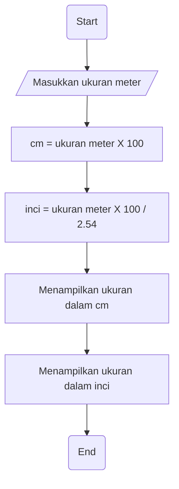

```mermaid
    flowchart TD;
    A(Start) --> B[/Masukkan ukuran meter/]
    B --> C[cm = ukuran meter X 100]
    C --> D[inci = ukuran meter X 100 / 2.54]
    D --> E[Menampilkan ukuran dalam cm]
    E --> F[Menampilkan ukuran dalam inci]
    F --> G(End)
```
