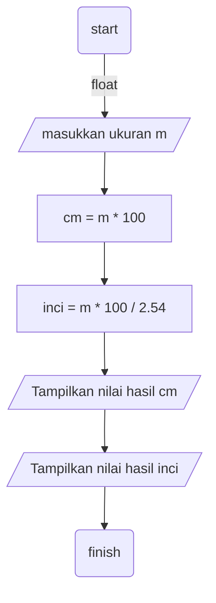

```mermaid
    flowchart TD;
    A(start) --float--> B[/masukkan ukuran m/];
    B --> C[cm = m * 100];
    C --> D[inci = m * 100 / 2.54];
    D --> E[/Tampilkan nilai hasil cm/];
    E --> F[/Tampilkan nilai hasil inci/];
    F --> G(finish);
```
